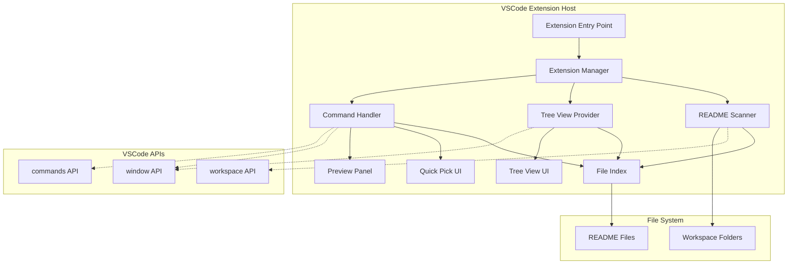

# Design Document: README Manager VSCode Extension

## Overview

README Manager 是一个 VSCode 扩展，为开发者提供集中化的 README 文件管理和导航功能。该扩展通过自动发现、索引和组织工作区中的所有 README 文件，解决了多模块项目中文档分散的问题。

### 核心功能
- **自动发现与索引**：扫描工作区并识别所有 README 文件
- **树形视图**：在侧边栏展示 README 文件的层次结构
- **快速导航**：通过命令面板快速跳转到任何 README 文件（使用 VSCode 内置 QuickPick + 模糊搜索）
- **内容预览**：支持 Markdown 渲染的预览功能（使用 VSCode 内置预览）
- **手动刷新**：通过刷新按钮重新扫描工作区

### 设计理念
本扩展充分利用 VSCode 的内置功能，避免重复实现已有的能力：
- **搜索功能**：使用 VSCode 自带的全局搜索（Ctrl+Shift+F），用户可以通过文件名过滤（如 `**/README*`）
- **文件监控**：依赖 VSCode 的文件系统监控，通过手动刷新按钮更新索引
- **Markdown 预览**：使用 VSCode 内置的 Markdown 预览功能

### 技术栈
- **语言**：TypeScript
- **框架**：VSCode Extension API
- **构建工具**：esbuild / webpack
- **测试框架**：Mocha / Jest
- **打包工具**：vsce (Visual Studio Code Extension Manager)

## Architecture

### 系统架构图



### 架构层次

1. **表示层 (Presentation Layer)**
   - Tree View UI：侧边栏树形视图
   - Quick Pick UI：快速选择界面（使用 VSCode 内置模糊搜索）
   - Preview Panel：预览面板（使用 VSCode 内置 Markdown 预览）
   - Command Palette：命令面板集成

2. **业务逻辑层 (Business Logic Layer)**
   - Extension Manager：扩展生命周期管理
   - Command Handler：命令处理和路由
   - Configuration Manager：配置管理

3. **数据访问层 (Data Access Layer)**
   - README Scanner：文件扫描器（一次性扫描 + 手动刷新）
   - File Index：文件索引存储（简化为数组/Map）

4. **基础设施层 (Infrastructure Layer)**
   - VSCode API 封装
   - 文件系统访问

### 设计原则

1. **单一职责**：每个组件专注于单一功能
2. **依赖注入**：通过构造函数注入依赖，便于测试
3. **简单优先**：优先使用 VSCode 内置功能，避免重复实现
4. **按需加载**：按需加载和初始化组件
5. **用户控制**：通过手动刷新让用户控制更新时机

## Components and Interfaces

### 1. Extension Manager

**职责**：管理扩展的生命周期，协调各个组件的初始化和销毁。

**接口定义**：

```typescript
interface IExtensionManager {
  /**
   * 激活扩展
   * @param context VSCode 扩展上下文
   */
  activate(context: vscode.ExtensionContext): Promise<void>;
  
  /**
   * 停用扩展，清理资源
   */
  deactivate(): Promise<void>;
  
  /**
   * 获取文件索引实例
   */
  getFileIndex(): IFileIndex;
}

class ExtensionManager implements IExtensionManager {
  private scanner: ReadmeScanner;
  private treeViewProvider: ReadmeTreeViewProvider;
  private commandHandler: CommandHandler;
  private fileIndex: FileIndex;
  
  constructor(private context: vscode.ExtensionContext) {}
  
  async activate(context: vscode.ExtensionContext): Promise<void> {
    // 初始化文件索引（简化为简单的 Map）
    this.fileIndex = new FileIndex();
    
    // 初始化扫描器（一次性扫描）
    this.scanner = new ReadmeScanner(this.fileIndex);
    
    // 初始化树形视图
    this.treeViewProvider = new ReadmeTreeViewProvider(this.fileIndex);
    
    // 初始化命令处理器
    this.commandHandler = new CommandHandler(
      this.fileIndex,
      this.scanner,
      this.treeViewProvider
    );
    
    // 执行初始扫描
    await this.scanner.scanWorkspace();
    
    // 注册命令
    this.commandHandler.registerCommands(context);
  }
  
  async deactivate(): Promise<void> {
    this.treeViewProvider.dispose();
  }
}
```

### 2. README Scanner

**职责**：扫描工作区，发现并索引所有 README 文件。采用一次性扫描 + 手动刷新的简化模式。

**接口定义**：

```typescript
interface IReadmeScanner {
  /**
   * 扫描整个工作区
   */
  scanWorkspace(): Promise<void>;
  
  /**
   * 扫描指定文件夹
   * @param folderUri 文件夹 URI
   */
  scanFolder(folderUri: vscode.Uri): Promise<ReadmeFile[]>;
  
  /**
   * 检查文件是否为 README 文件
   * @param fileName 文件名
   */
  isReadmeFile(fileName: string): boolean;
}

interface ReadmeFile {
  uri: vscode.Uri;
  relativePath: string;
  workspaceFolder: vscode.WorkspaceFolder;
  fileName: string;
  fileType: 'markdown' | 'text' | 'rst' | 'other';
}

class ReadmeScanner implements IReadmeScanner {
  private readonly readmePatterns: RegExp[];
  private readonly excludePatterns: string[];
  
  constructor(private fileIndex: IFileIndex) {
    // 从配置读取自定义模式
    const config = vscode.workspace.getConfiguration('readmeManager');
    const customPatterns = config.get<string[]>('filePatterns', []);
    
    // 默认模式
    const defaultPatterns = [
      /^readme\.md$/i,
      /^readme\.txt$/i,
      /^readme\.rst$/i,
      /^readme$/i,
      /^read\.me$/i
    ];
    
    this.readmePatterns = [
      ...defaultPatterns,
      ...customPatterns.map(p => new RegExp(p, 'i'))
    ];
    
    // 排除模式
    this.excludePatterns = config.get<string[]>('excludePatterns', [
      '**/node_modules/**',
      '**/.git/**',
      '**/dist/**',
      '**/build/**',
      '**/.vscode/**'
    ]);
  }
  
  async scanWorkspace(): Promise<void> {
    const folders = vscode.workspace.workspaceFolders;
    if (!folders) {
      return;
    }
    
    // 清空现有索引
    this.fileIndex.clear();
    
    // 并行扫描所有工作区文件夹
    const scanPromises = folders.map(folder => this.scanFolder(folder.uri));
    const results = await Promise.all(scanPromises);
    
    // 将结果添加到索引
    results.flat().forEach(file => this.fileIndex.addFile(file));
  }
  
  async scanFolder(folderUri: vscode.Uri): Promise<ReadmeFile[]> {
    const files: ReadmeFile[] = [];
    
    // 使用 workspace.findFiles 进行高效扫描
    // 使用 glob 模式匹配所有可能的 README 文件
    const pattern = new vscode.RelativePattern(
      folderUri,
      '**/README{.md,.txt,.rst,}'
    );
    
    const foundUris = await vscode.workspace.findFiles(
      pattern,
      `{${this.excludePatterns.join(',')}}`
    );
    
    for (const uri of foundUris) {
      const fileName = path.basename(uri.fsPath);
      if (this.isReadmeFile(fileName)) {
        const workspaceFolder = vscode.workspace.getWorkspaceFolder(uri);
        if (workspaceFolder) {
          files.push({
            uri,
            relativePath: vscode.workspace.asRelativePath(uri),
            workspaceFolder,
            fileName,
            fileType: this.detectFileType(fileName)
          });
        }
      }
    }
    
    return files;
  }
  
  isReadmeFile(fileName: string): boolean {
    return this.readmePatterns.some(pattern => pattern.test(fileName));
  }
  
  private detectFileType(fileName: string): ReadmeFile['fileType'] {
    const ext = path.extname(fileName).toLowerCase();
    switch (ext) {
      case '.md': return 'markdown';
      case '.txt': return 'text';
      case '.rst': return 'rst';
      default: return 'other';
    }
  }
}
```

### 3. File Index

**职责**：存储和管理 README 文件的索引数据。简化为简单的 Map 结构。

**接口定义**：

```typescript
interface IFileIndex {
  /**
   * 添加文件到索引
   */
  addFile(file: ReadmeFile): void;
  
  /**
   * 从索引中移除文件
   */
  removeFile(uri: vscode.Uri): void;
  
  /**
   * 获取所有文件
   */
  getAllFiles(): ReadmeFile[];
  
  /**
   * 按工作区文件夹分组获取文件
   */
  getFilesByWorkspace(): Map<vscode.WorkspaceFolder, ReadmeFile[]>;
  
  /**
   * 根据 URI 查找文件
   */
  findByUri(uri: vscode.Uri): ReadmeFile | undefined;
  
  /**
   * 清空索引
   */
  clear(): void;
  
  /**
   * 获取文件数量
   */
  getCount(): number;
}

class FileIndex implements IFileIndex {
  private files: Map<string, ReadmeFile> = new Map();
  
  addFile(file: ReadmeFile): void {
    const key = file.uri.toString();
    this.files.set(key, file);
  }
  
  removeFile(uri: vscode.Uri): void {
    const key = uri.toString();
    this.files.delete(key);
  }
  
  getAllFiles(): ReadmeFile[] {
    return Array.from(this.files.values());
  }
  
  getFilesByWorkspace(): Map<vscode.WorkspaceFolder, ReadmeFile[]> {
    const grouped = new Map<vscode.WorkspaceFolder, ReadmeFile[]>();
    
    for (const file of this.files.values()) {
      const existing = grouped.get(file.workspaceFolder) || [];
      existing.push(file);
      grouped.set(file.workspaceFolder, existing);
    }
    
    return grouped;
  }
  
  findByUri(uri: vscode.Uri): ReadmeFile | undefined {
    return this.files.get(uri.toString());
  }
  
  clear(): void {
    this.files.clear();
  }
  
  getCount(): number {
    return this.files.size;
  }
}
```

### 4. Tree View Provider

**职责**：为侧边栏提供树形视图数据。

**接口定义**：

```typescript
interface IReadmeTreeViewProvider extends vscode.TreeDataProvider<TreeNode> {
  /**
   * 刷新树形视图
   */
  refresh(): void;
  
  /**
   * 显示指定文件
   */
  reveal(file: ReadmeFile): Promise<void>;
}

type TreeNode = WorkspaceFolderNode | ReadmeFileNode;

interface WorkspaceFolderNode {
  type: 'workspace';
  folder: vscode.WorkspaceFolder;
  children: ReadmeFileNode[];
}

interface ReadmeFileNode {
  type: 'file';
  file: ReadmeFile;
}

class ReadmeTreeViewProvider implements IReadmeTreeViewProvider {
  private treeView: vscode.TreeView<TreeNode>;
  private changeEmitter = new vscode.EventEmitter<TreeNode | undefined>();
  
  readonly onDidChangeTreeData = this.changeEmitter.event;
  
  constructor(private fileIndex: IFileIndex) {
    // 创建树形视图
    this.treeView = vscode.window.createTreeView('readmeManager.treeView', {
      treeDataProvider: this,
      showCollapseAll: true
    });
  }
  
  refresh(): void {
    this.changeEmitter.fire(undefined);
  }
  
  async reveal(file: ReadmeFile): Promise<void> {
    const node: ReadmeFileNode = { type: 'file', file };
    await this.treeView.reveal(node, { select: true, focus: true });
  }
  
  getTreeItem(element: TreeNode): vscode.TreeItem {
    if (element.type === 'workspace') {
      return this.createWorkspaceFolderItem(element);
    } else {
      return this.createReadmeFileItem(element);
    }
  }
  
  getChildren(element?: TreeNode): TreeNode[] {
    if (!element) {
      // 根节点：返回工作区文件夹
      return this.getRootNodes();
    }
    
    if (element.type === 'workspace') {
      // 工作区节点：返回该工作区的 README 文件
      return element.children;
    }
    
    // 文件节点没有子节点
    return [];
  }
  
  getParent(element: TreeNode): TreeNode | undefined {
    if (element.type === 'file') {
      // 查找包含此文件的工作区节点
      const workspaceNodes = this.getRootNodes();
      return workspaceNodes.find(node =>
        node.type === 'workspace' &&
        node.folder === element.file.workspaceFolder
      );
    }
    return undefined;
  }
  
  private getRootNodes(): TreeNode[] {
    const filesByWorkspace = this.fileIndex.getFilesByWorkspace();
    const folders = vscode.workspace.workspaceFolders || [];
    
    if (folders.length === 0) {
      return [];
    }
    
    // 如果只有一个工作区，直接显示文件
    if (folders.length === 1) {
      const files = filesByWorkspace.get(folders[0]) || [];
      return files.map(file => ({ type: 'file', file } as ReadmeFileNode));
    }
    
    // 多个工作区，按文件夹分组
    return folders.map(folder => {
      const files = filesByWorkspace.get(folder) || [];
      const children: ReadmeFileNode[] = files.map(file => ({
        type: 'file',
        file
      }));
      
      return {
        type: 'workspace',
        folder,
        children
      } as WorkspaceFolderNode;
    });
  }
  
  private createWorkspaceFolderItem(node: WorkspaceFolderNode): vscode.TreeItem {
    const item = new vscode.TreeItem(
      node.folder.name,
      vscode.TreeItemCollapsibleState.Expanded
    );
    
    item.iconPath = new vscode.ThemeIcon('folder');
    item.contextValue = 'workspaceFolder';
    item.description = `${node.children.length} README files`;
    
    return item;
  }
  
  private createReadmeFileItem(node: ReadmeFileNode): vscode.TreeItem {
    const file = node.file;
    const item = new vscode.TreeItem(
      file.fileName,
      vscode.TreeItemCollapsibleState.None
    );
    
    // 设置图标
    item.iconPath = this.getFileIcon(file.fileType);
    
    // 设置描述（相对路径）
    const dirPath = path.dirname(file.relativePath);
    item.description = dirPath === '.' ? '' : dirPath;
    
    // 设置工具提示
    item.tooltip = file.relativePath;
    
    // 设置点击命令
    item.command = {
      command: 'readmeManager.openFile',
      title: 'Open README',
      arguments: [file.uri]
    };
    
    // 设置上下文值（用于右键菜单）
    item.contextValue = 'readmeFile';
    
    return item;
  }
  
  private getFileIcon(fileType: ReadmeFile['fileType']): vscode.ThemeIcon {
    switch (fileType) {
      case 'markdown':
        return new vscode.ThemeIcon('markdown');
      case 'text':
        return new vscode.ThemeIcon('file-text');
      case 'rst':
        return new vscode.ThemeIcon('file-code');
      default:
        return new vscode.ThemeIcon('file');
    }
  }
  
  dispose(): void {
    this.treeView.dispose();
    this.changeEmitter.dispose();
  }
}
```


### 5. Command Handler

**职责**：处理用户命令，协调各组件完成操作。

**接口定义**：

```typescript
interface ICommandHandler {
  /**
   * 注册所有命令
   */
  registerCommands(context: vscode.ExtensionContext): void;
}

class CommandHandler implements ICommandHandler {
  constructor(
    private fileIndex: IFileIndex,
    private scanner: IReadmeScanner,
    private treeViewProvider: IReadmeTreeViewProvider
  ) {}
  
  registerCommands(context: vscode.ExtensionContext): void {
    // 打开文件命令
    context.subscriptions.push(
      vscode.commands.registerCommand(
        'readmeManager.openFile',
        (uri: vscode.Uri) => this.openFile(uri)
      )
    );
    
    // 快速导航命令（使用 VSCode 内置模糊搜索）
    context.subscriptions.push(
      vscode.commands.registerCommand(
        'readmeManager.quickOpen',
        () => this.quickOpen()
      )
    );
    
    // 预览命令（使用 VSCode 内置预览）
    context.subscriptions.push(
      vscode.commands.registerCommand(
        'readmeManager.preview',
        (uri: vscode.Uri) => this.preview(uri)
      )
    );
    
    // 刷新命令
    context.subscriptions.push(
      vscode.commands.registerCommand(
        'readmeManager.refresh',
        () => this.refresh()
      )
    );
  }
  
  private async openFile(uri: vscode.Uri): Promise<void> {
    try {
      const document = await vscode.workspace.openTextDocument(uri);
      await vscode.window.showTextDocument(document);
    } catch (error) {
      vscode.window.showErrorMessage(
        `Failed to open file: ${error.message}`
      );
    }
  }
  
  private async quickOpen(): Promise<void> {
    const files = this.fileIndex.getAllFiles();
    
    if (files.length === 0) {
      vscode.window.showInformationMessage('No README files found in workspace');
      return;
    }
    
    // 创建 QuickPick 项（VSCode 内置模糊搜索）
    const items: vscode.QuickPickItem[] = files.map(file => ({
      label: file.fileName,
      description: file.relativePath,
      detail: file.workspaceFolder.name,
      // 存储 URI 用于后续打开
      uri: file.uri
    } as any));
    
    // 显示 QuickPick（VSCode 内置模糊搜索）
    const selected = await vscode.window.showQuickPick(items, {
      placeHolder: 'Select a README file to open',
      matchOnDescription: true,
      matchOnDetail: true
    });
    
    if (selected && (selected as any).uri) {
      await this.openFile((selected as any).uri);
    }
  }
  
  private async preview(uri: vscode.Uri): Promise<void> {
    try {
      const file = this.fileIndex.findByUri(uri);
      
      if (!file) {
        vscode.window.showErrorMessage('File not found in index');
        return;
      }
      
      // 对于 Markdown 文件，使用 VSCode 内置预览
      if (file.fileType === 'markdown') {
        await vscode.commands.executeCommand(
          'markdown.showPreview',
          uri
        );
      } else {
        // 其他文件类型，在预览模式打开
        const document = await vscode.workspace.openTextDocument(uri);
        await vscode.window.showTextDocument(document, {
          preview: true,
          preserveFocus: true
        });
      }
    } catch (error) {
      vscode.window.showErrorMessage(
        `Failed to preview file: ${error.message}`
      );
    }
  }
  
  private async refresh(): Promise<void> {
    vscode.window.withProgress(
      {
        location: vscode.ProgressLocation.Notification,
        title: 'Refreshing README files...',
        cancellable: false
      },
      async () => {
        // 触发重新扫描
        await this.scanner.scanWorkspace();
        // 刷新树形视图
        this.treeViewProvider.refresh();
      }
    );
  }
}
```

## Data Models

### 核心数据模型

```typescript
/**
 * README 文件信息
 */
interface ReadmeFile {
  /** 文件 URI */
  uri: vscode.Uri;
  
  /** 相对于工作区的路径 */
  relativePath: string;
  
  /** 所属工作区文件夹 */
  workspaceFolder: vscode.WorkspaceFolder;
  
  /** 文件名 */
  fileName: string;
  
  /** 文件类型 */
  fileType: 'markdown' | 'text' | 'rst' | 'other';
}

/**
 * 树形视图节点
 */
type TreeNode = WorkspaceFolderNode | ReadmeFileNode;

interface WorkspaceFolderNode {
  type: 'workspace';
  folder: vscode.WorkspaceFolder;
  children: ReadmeFileNode[];
}

interface ReadmeFileNode {
  type: 'file';
  file: ReadmeFile;
}

/**
 * 扩展配置
 */
interface ExtensionConfiguration {
  /** 自定义文件名模式 */
  filePatterns: string[];
  
  /** 排除目录模式 */
  excludePatterns: string[];
}
```

### 配置模式（package.json）

```json
{
  "contributes": {
    "configuration": {
      "title": "README Manager",
      "properties": {
        "readmeManager.filePatterns": {
          "type": "array",
          "default": [],
          "description": "Custom README file name patterns (regex)",
          "items": {
            "type": "string"
          }
        },
        "readmeManager.excludePatterns": {
          "type": "array",
          "default": [
            "**/node_modules/**",
            "**/.git/**",
            "**/dist/**",
            "**/build/**",
            "**/.vscode/**"
          ],
          "description": "Directories to exclude from scanning",
          "items": {
            "type": "string"
          }
        }
      }
    }
  }
}
```

## Error Handling

### 错误处理策略

1. **文件访问错误**
   - **场景**：无权限读取文件、文件不存在
   - **处理**：记录警告日志，继续处理其他文件，不中断整体流程
   - **用户反馈**：在输出通道显示警告信息

2. **扫描超时**
   - **场景**：大型工作区扫描时间过长
   - **处理**：显示进度通知，让用户了解扫描状态
   - **用户反馈**：显示进度通知

3. **扩展初始化失败**
   - **场景**：VSCode API 不可用、依赖缺失
   - **处理**：记录详细错误信息到输出通道
   - **用户反馈**：显示错误通知，提供诊断信息

4. **预览失败**
   - **场景**：Markdown 预览失败、文件无法打开
   - **处理**：降级到普通文本编辑器打开
   - **用户反馈**：显示警告通知

### 错误处理实现

```typescript
class ErrorHandler {
  private outputChannel: vscode.OutputChannel;
  
  constructor() {
    this.outputChannel = vscode.window.createOutputChannel('README Manager');
  }
  
  /**
   * 处理文件访问错误
   */
  handleFileAccessError(uri: vscode.Uri, error: Error): void {
    const message = `Failed to access file ${uri.fsPath}: ${error.message}`;
    this.outputChannel.appendLine(`[WARNING] ${message}`);
    console.warn(message, error);
  }
  
  /**
   * 处理扫描错误
   */
  handleScanError(error: Error): void {
    const message = `Scan failed: ${error.message}`;
    this.outputChannel.appendLine(`[ERROR] ${message}`);
    vscode.window.showErrorMessage(
      `README Manager: ${message}`,
      'View Output'
    ).then(selection => {
      if (selection === 'View Output') {
        this.outputChannel.show();
      }
    });
  }
  
  /**
   * 处理预览错误
   */
  handlePreviewError(error: Error): void {
    const message = `Preview failed: ${error.message}`;
    this.outputChannel.appendLine(`[WARNING] ${message}`);
    vscode.window.showWarningMessage(
      'README Manager: Failed to preview file. Opening in editor instead.'
    );
  }
  
  /**
   * 处理初始化错误
   */
  handleInitializationError(error: Error): void {
    const message = `Extension initialization failed: ${error.message}`;
    this.outputChannel.appendLine(`[FATAL] ${message}`);
    this.outputChannel.appendLine(error.stack || '');
    
    vscode.window.showErrorMessage(
      'README Manager failed to initialize. See output for details.',
      'View Output'
    ).then(selection => {
      if (selection === 'View Output') {
        this.outputChannel.show();
      }
    });
  }
  
  dispose(): void {
    this.outputChannel.dispose();
  }
}
```

### 日志级别

- **FATAL**：扩展无法启动的致命错误
- **ERROR**：功能性错误，但不影响扩展运行
- **WARNING**：非关键性问题，可以继续运行
- **INFO**：一般信息，用于调试

## Testing Strategy

### 测试方法

本扩展采用**双重测试策略**：
- **单元测试**：验证具体示例、边界条件和错误处理
- **集成测试**：验证 VSCode API 集成和端到端工作流

由于 VSCode 扩展主要涉及 UI 交互、文件系统操作和外部 API 集成，**不适合使用属性测试（Property-Based Testing）**。我们将专注于：
- 单元测试覆盖核心逻辑
- 集成测试验证 VSCode API 交互
- 手动测试验证用户体验

### 测试框架

- **单元测试**：Jest 或 Mocha
- **集成测试**：VSCode Extension Test Runner
- **Mock 库**：sinon 用于模拟 VSCode API

### 单元测试覆盖

#### 1. README Scanner 测试

```typescript
describe('ReadmeScanner', () => {
  describe('isReadmeFile', () => {
    it('should recognize standard README files', () => {
      const scanner = new ReadmeScanner(mockFileIndex);
      
      expect(scanner.isReadmeFile('README.md')).toBe(true);
      expect(scanner.isReadmeFile('readme.txt')).toBe(true);
      expect(scanner.isReadmeFile('README')).toBe(true);
    });
    
    it('should reject non-README files', () => {
      const scanner = new ReadmeScanner(mockFileIndex);
      
      expect(scanner.isReadmeFile('package.json')).toBe(false);
      expect(scanner.isReadmeFile('index.ts')).toBe(false);
    });
    
    it('should support custom patterns from configuration', () => {
      // 测试自定义模式配置
    });
  });
  
  describe('scanFolder', () => {
    it('should find all README files in a folder', async () => {
      // 测试文件夹扫描
    });
    
    it('should exclude files in node_modules', async () => {
      // 测试排除模式
    });
    
    it('should handle permission errors gracefully', async () => {
      // 测试错误处理
    });
  });
});
```

#### 2. File Index 测试

```typescript
describe('FileIndex', () => {
  it('should add files to index', () => {
    const index = new FileIndex();
    const file = createMockReadmeFile();
    
    index.addFile(file);
    
    expect(index.getCount()).toBe(1);
    expect(index.findByUri(file.uri)).toEqual(file);
  });
  
  it('should remove files from index', () => {
    const index = new FileIndex();
    const file = createMockReadmeFile();
    
    index.addFile(file);
    index.removeFile(file.uri);
    
    expect(index.getCount()).toBe(0);
    expect(index.findByUri(file.uri)).toBeUndefined();
  });
  
  it('should group files by workspace', () => {
    // 测试按工作区分组
  });
});
```

#### 3. Command Handler 测试

```typescript
describe('CommandHandler', () => {
  it('should open file when command is executed', async () => {
    // 测试打开文件命令
  });
  
  it('should show quick pick for navigation', async () => {
    // 测试快速导航命令
  });
  
  it('should preview markdown files using VSCode preview', async () => {
    // 测试预览命令
  });
  
  it('should refresh index when refresh command is executed', async () => {
    // 测试刷新命令
  });
});
```

### 集成测试

#### 1. 扩展激活测试

```typescript
describe('Extension Activation', () => {
  it('should activate successfully', async () => {
    const extension = vscode.extensions.getExtension('your-publisher.readme-manager');
    await extension?.activate();
    
    expect(extension?.isActive).toBe(true);
  });
  
  it('should register all commands', async () => {
    const commands = await vscode.commands.getCommands();
    
    expect(commands).toContain('readmeManager.openFile');
    expect(commands).toContain('readmeManager.quickOpen');
    expect(commands).toContain('readmeManager.preview');
    expect(commands).toContain('readmeManager.refresh');
  });
  
  it('should create tree view', async () => {
    // 验证树形视图已创建
  });
});
```

#### 2. 命令执行测试

```typescript
describe('Commands', () => {
  it('should open file when command is executed', async () => {
    const uri = vscode.Uri.file('/path/to/README.md');
    await vscode.commands.executeCommand('readmeManager.openFile', uri);
    
    expect(vscode.window.activeTextEditor?.document.uri).toEqual(uri);
  });
  
  it('should show quick pick for navigation', async () => {
    // 测试快速导航命令
  });
  
  it('should preview markdown files', async () => {
    // 测试预览命令
  });
  
  it('should refresh index', async () => {
    // 测试刷新命令
  });
});
```

### 性能测试

```typescript
describe('Performance', () => {
  it('should scan 1000 files within 5 seconds', async () => {
    const startTime = Date.now();
    await scanner.scanWorkspace();
    const duration = Date.now() - startTime;
    
    expect(duration).toBeLessThan(5000);
  });
  
  it('should use less than 50MB memory', () => {
    // 测试内存使用
  });
});
```

### 测试覆盖率目标

- **单元测试覆盖率**：> 80%
- **核心逻辑覆盖率**：> 90%
- **集成测试**：覆盖所有主要用户流程

### 持续集成

- 使用 GitHub Actions 运行测试
- 每次 PR 自动运行测试套件
- 发布前运行完整测试


## Implementation Details

### 关键算法

#### 1. 文件扫描算法

使用 VSCode 的 `workspace.findFiles` API 进行高效扫描：

```typescript
async scanFolder(folderUri: vscode.Uri): Promise<ReadmeFile[]> {
  // 使用 glob 模式匹配
  const pattern = new vscode.RelativePattern(
    folderUri,
    '**/{README,readme}{.md,.txt,.rst,}'
  );
  
  // 排除不需要的目录
  const exclude = `{${this.excludePatterns.join(',')}}`;
  
  // VSCode 内部使用 ripgrep 进行快速文件搜索
  const uris = await vscode.workspace.findFiles(pattern, exclude);
  
  return this.processFoundFiles(uris);
}
```

**优化点**：
- 使用 glob 模式而非递归遍历
- 利用 VSCode 内置的 ripgrep 引擎
- 并行处理多个工作区文件夹

#### 2. 手动刷新机制

用户通过刷新按钮控制索引更新：

```typescript
private async refresh(): Promise<void> {
  vscode.window.withProgress(
    {
      location: vscode.ProgressLocation.Notification,
      title: 'Refreshing README files...',
      cancellable: false
    },
    async () => {
      // 重新扫描工作区
      await this.scanner.scanWorkspace();
      // 刷新树形视图
      this.treeViewProvider.refresh();
    }
  );
}
```

**优化点**：
- 用户控制更新时机
- 显示进度通知
- 简化实现，无需复杂的文件监控逻辑

### VSCode API 使用

#### 1. Extension Activation

```typescript
// extension.ts
export function activate(context: vscode.ExtensionContext) {
  const manager = new ExtensionManager(context);
  return manager.activate(context);
}

export function deactivate() {
  // 清理资源
}
```

#### 2. Tree View Registration

```typescript
// package.json
{
  "contributes": {
    "views": {
      "explorer": [
        {
          "id": "readmeManager.treeView",
          "name": "README Files",
          "icon": "resources/icon.svg",
          "contextualTitle": "README Manager"
        }
      ]
    },
    "menus": {
      "view/item/context": [
        {
          "command": "readmeManager.preview",
          "when": "view == readmeManager.treeView && viewItem == readmeFile",
          "group": "navigation"
        }
      ]
    }
  }
}
```

#### 3. Command Registration

```typescript
// package.json
{
  "contributes": {
    "commands": [
      {
        "command": "readmeManager.quickOpen",
        "title": "README Manager: Quick Open",
        "icon": "$(search)"
      },
      {
        "command": "readmeManager.refresh",
        "title": "README Manager: Refresh",
        "icon": "$(refresh)"
      },
      {
        "command": "readmeManager.preview",
        "title": "README Manager: Preview",
        "icon": "$(open-preview)"
      }
    ],
    "keybindings": [
      {
        "command": "readmeManager.quickOpen",
        "key": "ctrl+shift+r",
        "mac": "cmd+shift+r"
      }
    ]
  }
}
```

#### 4. Configuration Schema

```typescript
// package.json
{
  "contributes": {
    "configuration": {
      "title": "README Manager",
      "properties": {
        "readmeManager.filePatterns": {
          "type": "array",
          "default": [],
          "description": "Additional README file patterns (regex)",
          "items": { "type": "string" }
        },
        "readmeManager.excludePatterns": {
          "type": "array",
          "default": [
            "**/node_modules/**",
            "**/.git/**",
            "**/dist/**",
            "**/build/**"
          ],
          "description": "Glob patterns to exclude",
          "items": { "type": "string" }
        }
      }
    }
  }
}
```

### 性能优化策略

#### 1. 懒加载

- 扩展激活时只初始化核心组件
- 首次使用时才加载预览功能
- 按需创建预览面板

#### 2. 简化索引

```typescript
class FileIndex {
  // 简化为简单的 Map 结构
  private files: Map<string, ReadmeFile> = new Map();
  
  // 无需复杂的事件系统和缓存
  addFile(file: ReadmeFile): void {
    this.files.set(file.uri.toString(), file);
  }
}
```

#### 3. 利用 VSCode 内置功能

- **搜索**：使用 VSCode 的 Ctrl+Shift+F 全局搜索
- **模糊匹配**：使用 QuickPick 的内置模糊搜索
- **Markdown 预览**：使用 VSCode 的内置 Markdown 预览
- **文件监控**：依赖 VSCode 的文件系统监控，通过手动刷新更新

#### 4. 异步操作

所有 I/O 操作使用异步 API：

```typescript
// 好的做法
const document = await vscode.workspace.openTextDocument(uri);
const text = document.getText();

// 避免同步操作
// const text = fs.readFileSync(uri.fsPath, 'utf-8'); // ❌
```

### 扩展打包

#### 1. 项目结构

```
readme-manager/
├── src/
│   ├── extension.ts          # 入口文件
│   ├── extensionManager.ts   # 扩展管理器
│   ├── scanner.ts            # 文件扫描器
│   ├── fileIndex.ts          # 文件索引
│   ├── treeViewProvider.ts   # 树形视图
│   ├── commandHandler.ts     # 命令处理
│   └── errorHandler.ts       # 错误处理
├── test/
│   ├── suite/
│   │   ├── extension.test.ts
│   │   ├── scanner.test.ts
│   │   └── ...
│   └── runTest.ts
├── resources/
│   └── icon.svg
├── .vscodeignore
├── package.json
├── tsconfig.json
├── README.md
├── CHANGELOG.md
└── LICENSE
```

#### 2. package.json 配置

```json
{
  "name": "readme-manager",
  "displayName": "README Manager",
  "description": "Centralized README file management for VSCode",
  "version": "1.0.0",
  "publisher": "your-publisher-name",
  "engines": {
    "vscode": "^1.75.0"
  },
  "categories": [
    "Other"
  ],
  "keywords": [
    "readme",
    "documentation",
    "navigation",
    "markdown"
  ],
  "activationEvents": [
    "onStartupFinished"
  ],
  "main": "./out/extension.js",
  "contributes": {
    "views": {},
    "commands": [],
    "configuration": {},
    "keybindings": []
  },
  "scripts": {
    "vscode:prepublish": "npm run compile",
    "compile": "tsc -p ./",
    "watch": "tsc -watch -p ./",
    "pretest": "npm run compile",
    "test": "node ./out/test/runTest.js",
    "package": "vsce package",
    "publish": "vsce publish"
  },
  "devDependencies": {
    "@types/vscode": "^1.75.0",
    "@types/node": "^18.x",
    "@types/mocha": "^10.0.0",
    "@vscode/test-electron": "^2.3.0",
    "typescript": "^5.0.0",
    "mocha": "^10.2.0",
    "vsce": "^2.15.0"
  },
  "repository": {
    "type": "git",
    "url": "https://github.com/your-username/readme-manager"
  },
  "license": "MIT"
}
```

#### 3. 打包命令

```bash
# 编译 TypeScript
npm run compile

# 运行测试
npm test

# 打包为 .vsix
npm run package

# 发布到 GitHub
git tag v1.0.0
git push origin v1.0.0
gh release create v1.0.0 readme-manager-1.0.0.vsix
```

#### 4. .vscodeignore

```
.vscode/**
.vscode-test/**
src/**
test/**
.gitignore
.yarnrc
vsc-extension-quickstart.md
**/tsconfig.json
**/.eslintrc.json
**/*.map
**/*.ts
!out/**/*.js
```

### 发布流程

1. **准备发布**
   - 更新版本号
   - 更新 CHANGELOG.md
   - 运行完整测试套件
   - 构建生产版本

2. **打包扩展**
   ```bash
   vsce package
   ```

3. **创建 GitHub Release**
   ```bash
   git tag v1.0.0
   git push origin v1.0.0
   gh release create v1.0.0 \
     --title "v1.0.0" \
     --notes "Initial release" \
     readme-manager-1.0.0.vsix
   ```

4. **安装说明**
   用户可以通过以下方式安装：
   - 从 GitHub Releases 下载 .vsix 文件
   - 在 VSCode 中使用 "Install from VSIX" 命令
   - 或使用命令行：`code --install-extension readme-manager-1.0.0.vsix`

### 开发工作流

#### 1. 本地开发

```bash
# 安装依赖
npm install

# 编译并监控变化
npm run watch

# 在 VSCode 中按 F5 启动调试
```

#### 2. 调试配置（.vscode/launch.json）

```json
{
  "version": "0.2.0",
  "configurations": [
    {
      "name": "Run Extension",
      "type": "extensionHost",
      "request": "launch",
      "args": [
        "--extensionDevelopmentPath=${workspaceFolder}"
      ],
      "outFiles": [
        "${workspaceFolder}/out/**/*.js"
      ],
      "preLaunchTask": "${defaultBuildTask}"
    },
    {
      "name": "Extension Tests",
      "type": "extensionHost",
      "request": "launch",
      "args": [
        "--extensionDevelopmentPath=${workspaceFolder}",
        "--extensionTestsPath=${workspaceFolder}/out/test/suite/index"
      ],
      "outFiles": [
        "${workspaceFolder}/out/test/**/*.js"
      ],
      "preLaunchTask": "${defaultBuildTask}"
    }
  ]
}
```

#### 3. 任务配置（.vscode/tasks.json）

```json
{
  "version": "2.0.0",
  "tasks": [
    {
      "type": "npm",
      "script": "watch",
      "problemMatcher": "$tsc-watch",
      "isBackground": true,
      "presentation": {
        "reveal": "never"
      },
      "group": {
        "kind": "build",
        "isDefault": true
      }
    }
  ]
}
```

## 总结

README Manager 扩展通过以下技术方案实现了高效的 README 文件管理：

### 核心技术决策

1. **文件发现**：使用 VSCode 的 `workspace.findFiles` API 和 glob 模式进行高效扫描
2. **手动刷新**：通过刷新按钮让用户控制索引更新时机，简化实现
3. **数据管理**：使用简单的 Map 结构存储索引，无需复杂的事件系统
4. **用户界面**：利用 VSCode 原生 UI 组件（TreeView、QuickPick）提供一致的用户体验
5. **利用内置功能**：充分使用 VSCode 的内置搜索、预览和文件监控功能

### 架构优势

- **简洁设计**：移除冗余组件，专注核心功能
- **模块化**：各组件职责清晰，易于测试和维护
- **可扩展性**：支持自定义文件模式和排除规则
- **用户友好**：利用 VSCode 内置功能，提供熟悉的用户体验

### 简化后的功能

**保留的核心功能**：
- ✅ 树形视图：侧边栏专门展示 README 文件
- ✅ 快速导航：使用 VSCode QuickPick + 内置模糊搜索
- ✅ 预览：使用 VSCode 内置 Markdown 预览
- ✅ 手动刷新：用户控制的索引更新

**移除的功能（使用 VSCode 内置替代）**：
- ❌ 全文搜索 → 使用 VSCode 的 Ctrl+Shift+F 全局搜索
- ❌ 实时文件监控 → 使用手动刷新按钮

### 下一步

设计文档已完成，可以进入任务分解阶段，将设计转化为可执行的开发任务。

